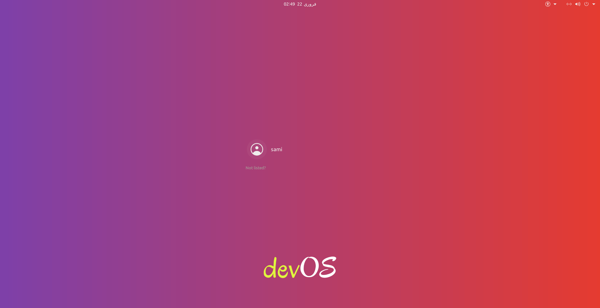

  <h1>devOS 1.0</h1>

<!-- PROJECT LOGO -->
 

  

  <h3 align="center">devOS: ubuntu but for programmers</h3>

  

    ubuntu bootstrapped with all the goto apps and an aesthetic look    
   

     
     

     <a href="#screenshots">Screenshots</a>
    · 
    <a href="https://github.com/imsamimalik/devOS/issues">Report Bug</a>
  

<!-- TABLE OF CONTENTS -->

  
Table of Contents

  <ol>
    <li><a href="#about-the-project">About The Project</a></li>
    <li><a href="#built-in-apps">Built in Apps</a></li>
    <li><a href="#themes">Themes</a></li>
    <li><a href="#prerequisites">Prerequisites</a></li>
    <li><a href="#installation">Installation</a></li>
    <li><a href="#license">License</a></li>
    <li><a href="#contact">Contact</a></li>
  </ol>

<!-- ABOUT THE PROJECT -->
## About The Project
 

  <i style="font-size: 13px;">THIS PROJECT WAS DONE SOLELY FOR THE PURPOSE OF SAVING SOME TIME SO THAT I CAN SLEEP FOR SOME EXTRA HOURS 😄  </i>

  
As mentioned it's not a distro built from scratch but an ubuntu image bundled with all the software applications necessary for any programmer (like vscode, chrome, node) excluding all the unnecessary prebuilt ubuntu apps . But the question is why did I make this distro (like seriously no one asked for it 😏)?

Here's why:
* I'm the type of person, if I get comfortable with a certain UI, a slight change in it makes me anxious.
* I like to tickle with the ubuntu, and more often I mess up the UI to the extent that it's irreversible.
* So, I've to boot a fresh ubuntu loosing all my apps and customizations. And it takes me hours to get that UI again.
* Therefore, I recreated the UI I'm comfortable to, in the ubuntu ISO image (don't ask how much of a hectic process that was), so that I can just boot up the ISO to get all of my apps and customizations.

There were some backup apps (like timeshift) but sometimes they also messed the core files of ubuntu.

### Built in Apps

Apps that are built in devOS are: 

* VS Code
* Google Chrome
* Firefox
* NodeJS
* GNOME Extensions and Tweaks
  *    [Bluetooth Quick Connect](https://github.com/bjarosze/gnome-bluetooth-quick-connect)
  *    [Clipboard Indicator](https://github.com/Tudmotu/gnome-shell-extension-clipboard-indicator)
  *    [Improved Workspace Indicator](https://github.com/MichaelAquilina/improved-workspace-indicator)
  *    [Dash to Dock](https://micheleg.github.io/dash-to-dock/)
* Android Studio
* TimeShift (backup tool)
* VLC
* Docker
* [CMatrix](https://github.com/abishekvashok/cmatrix) (good old Matrix vibes)
* [Neofetch](https://github.com/dylanaraps/neofetch)
 

<!-- THEMES -->
## Themes

This gorgeous look has been made possible by the following themes: 
  * GTK Theme: [Orchis Theme](https://github.com/vinceliuice/Orchis-theme)
  * Icon Theme: [Colloid Theme](https://github.com/vinceliuice/Colloid-gtk-theme/tree/main/icon-theme)
  * GNOME Shell Theme: [Orchis Theme](https://github.com/vinceliuice/Orchis-theme)
  * Desktop & Login Wallpaper: [Dracula Theme](https://draculatheme.com/)
  * Plymouth Theme: [Vortex Ubuntu](https://github.com/emanuele-scarsella/vortex-ubuntu-plymouth-theme)

 

<!-- Prerequisites -->

## Prerequisites

    Prior linux experience required.

 

<!-- Installation -->

## Installation
  Installation is pretty easy. Just burn this ISO into any USB and boot it like any other OS.

 

<!-- LICENSE -->
## License

Distributed under the MIT License.

 

## Screenshots

 

    
  
Boot Loader

    
  
Installation Wizard

    
  
Installation Wizard

    
  
Login Screen

    
  
Lock Screen

    
  
Theme

    
  
Applications

    
  
Desktop

 

<!-- CONTACT -->
## Contact

Sami Malik - [@imsamimalik](https://instagram.com/imsamimalikk) - [hi@imsamimalik.com](mailto:hi@imsamimalik.com)

<!-- MARKDOWN LINKS & IMAGES -->
<!-- https://www.markdownguide.org/basic-syntax/#reference-style-links -->
[product-screenshot]: images/screenshot.png
